# KUAL Games & Utilities

> **Written by AI.** All of the code, tests and documentation in this repository were written by [Claude Code](https://claude.com/claude-code), Anthropic's AI coding agent. I ([@colonket](https://github.com/colonket)) directed the work, tested it on a real Kindle, and decided what to merge. See [How this was made](#how-this-was-made).

A suite of touch apps for jailbroken Kindles, launched from KUAL:

- **Lichess**: play rapid, classical and correspondence games against people, plus any time control against Stockfish or friends. It uses the official Board API.
- **Go (OGS)**: play correspondence and live games on [online-go.com](https://online-go.com) on 9×9, 13×13 or 19×19 boards. You can play OGS's bots, tap to place a stone and confirm it, pass, resign, mark dead stones and accept the score, and accept, decline or send challenges.
- **Life Counter**: a Magic: The Gathering life counter for 2–6 players. Panels are rotated to face each seat, and it tracks poison, commander damage and tax, energy and experience. It also has dice, a coin flip and a random first player.
- **Ports of [CrossPoint Apps](https://github.com/zakerytclarke/crosspoint-reader-apps)** (MIT):
  - **Chess**: full rules, with pass-and-play or a built-in engine.
  - **Sudoku**: puzzles have a unique solution, with notes and a mistake check.
  - **Dice & 8-Ball**: D6, an arrow spinner, D20, Magic 8-Ball and a coin flip.
  - **Calculator**
  - **Clock**: digital, analog or flip styles.
  - **Weather**: forecasts from Open-Meteo.
  - **Wikipedia**
  - **RSS & Reddit**
  - **DuckDuckGo**

  Every port that reads text uses one paginated reader, and articles can be saved for offline reading or exported to your Kindle documents.

Everything is written in Lua and runs on the **LuaJIT that ships with KOReader**, so there is nothing else to install.

## Screenshots

<table>
  <tr>
    <td align="center">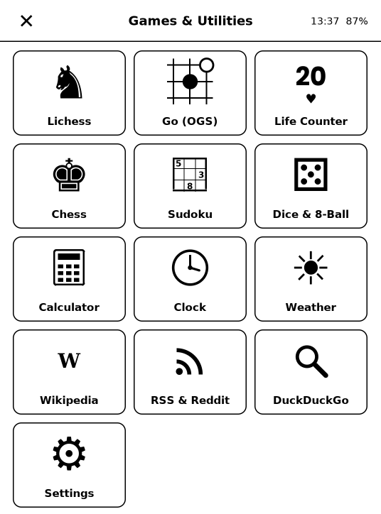<br><sub>App launcher</sub></td>
    <td align="center">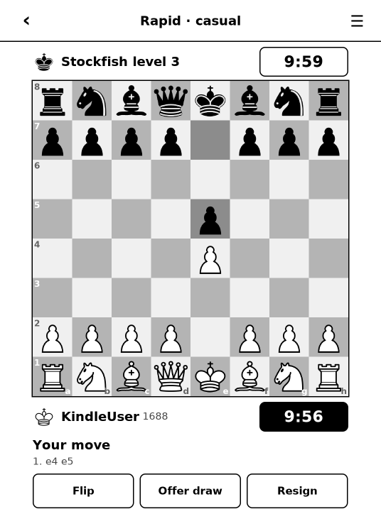<br><sub>Lichess vs. Stockfish</sub></td>
    <td align="center">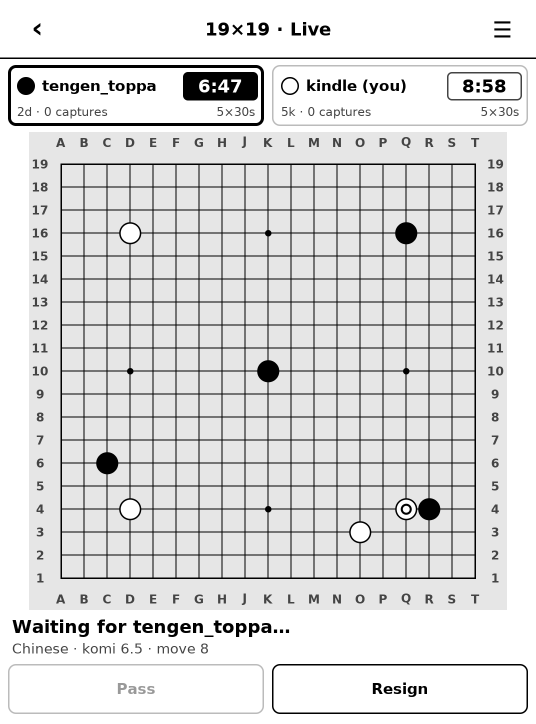<br><sub>Go (OGS), live 19×19</sub></td>
  </tr>
  <tr>
    <td align="center">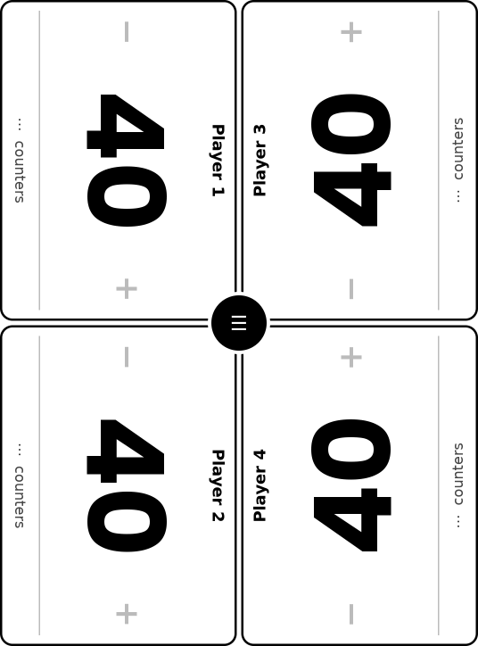<br><sub>Life Counter, 4 players</sub></td>
    <td align="center">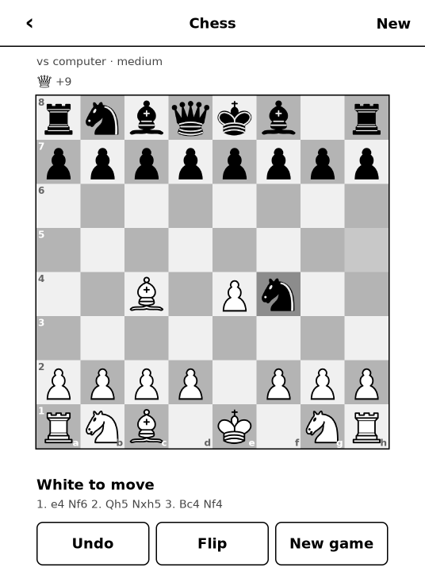<br><sub>Chess vs. the built-in engine</sub></td>
    <td align="center"><br><sub>Sudoku</sub></td>
  </tr>
  <tr>
    <td align="center">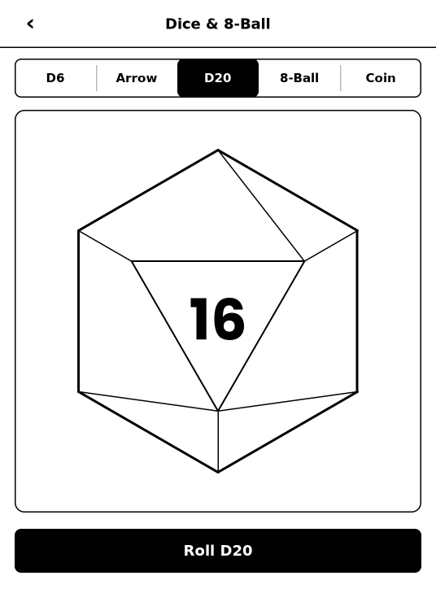<br><sub>Dice & 8-Ball</sub></td>
    <td align="center">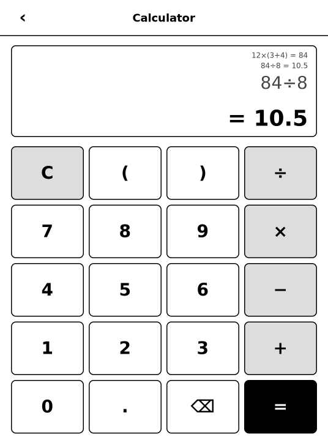<br><sub>Calculator</sub></td>
    <td align="center">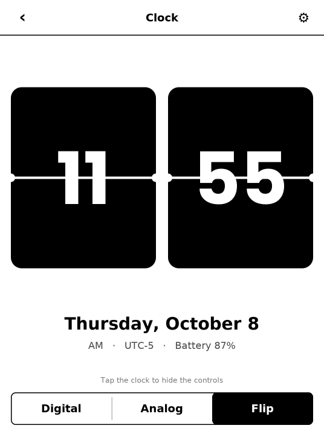<br><sub>Clock, flip style</sub></td>
  </tr>
  <tr>
    <td align="center">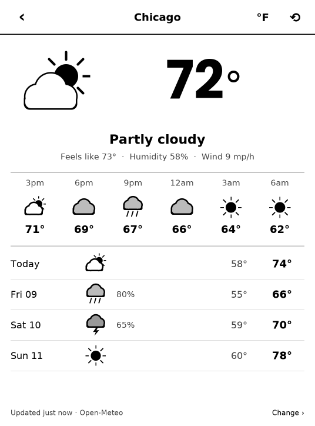<br><sub>Weather</sub></td>
    <td align="center">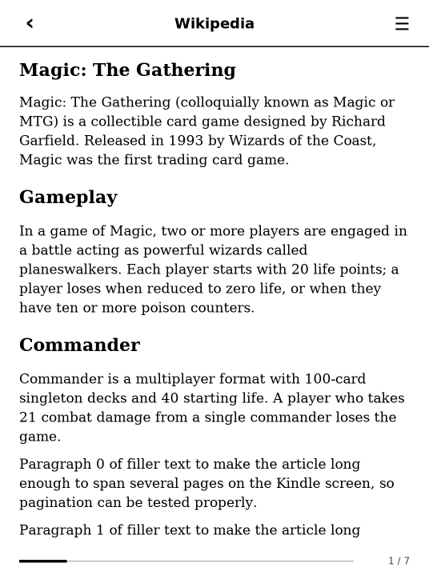<br><sub>Wikipedia</sub></td>
    <td align="center">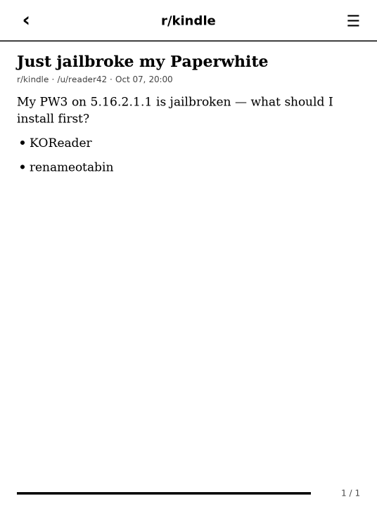<br><sub>RSS & Reddit</sub></td>
  </tr>
  <tr>
    <td align="center">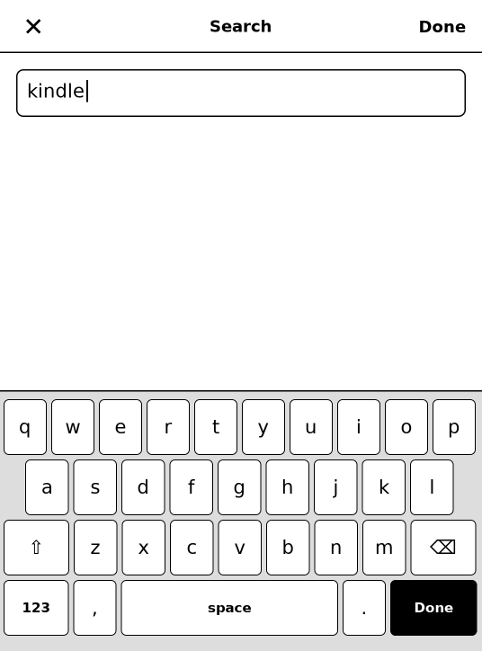<br><sub>DuckDuckGo search keyboard</sub></td>
    <td align="center">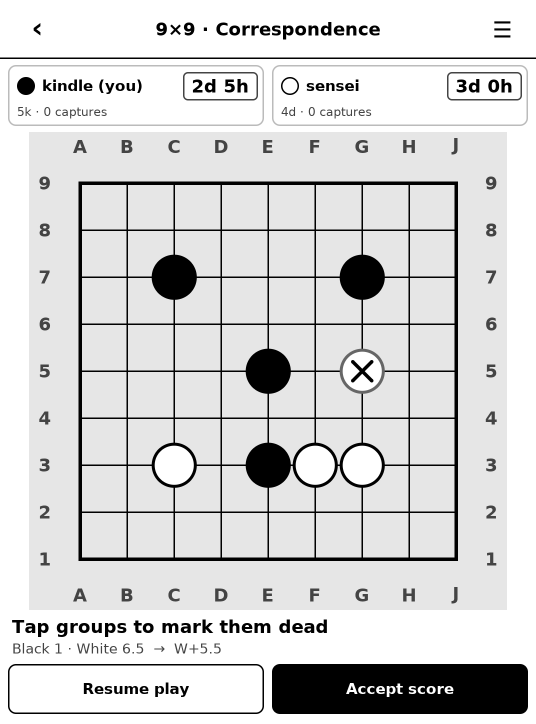<br><sub>Go (OGS), marking dead stones</sub></td>
    <td align="center">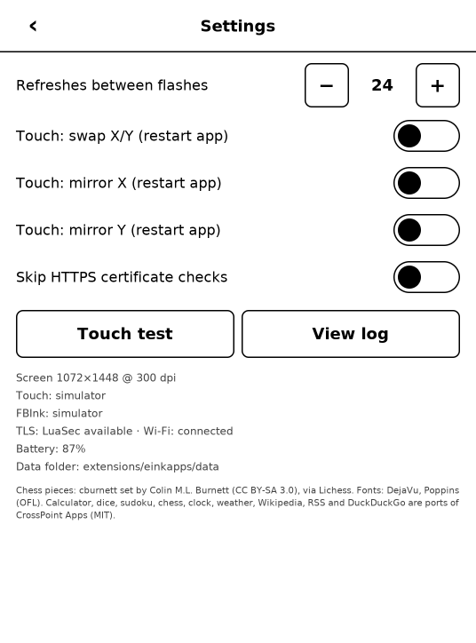<br><sub>Settings</sub></td>
  </tr>
</table>

These are frames from the simulator at the Paperwhite 3's native 1072×1448, the same pixels the app writes to the e-ink panel, shown at half size. To regenerate them, run `tests/test_all.sh` and then `tools/screenshots.py`.

## Requirements

- A jailbroken Kindle with **KUAL** and **KOReader** installed at `/mnt/us/koreader`. This was built and tested for the Paperwhite 3 (7th gen) on 5.16.2.1.1.
- Wi-Fi, for Lichess, Go (OGS), Weather, Wikipedia, RSS and DuckDuckGo.

## Install

1. Download this repository (Code → Download ZIP) and unzip it.
2. Connect the Kindle over USB and copy the `extension/einkapps` folder into the Kindle's `extensions` folder, so you end up with `extensions/einkapps/config.xml` on the Kindle.
3. Eject the Kindle, open **KUAL** and pick **Games & Utilities → App launcher**. Each app also has its own menu entry.

To leave an app, tap **‹** in the top-left corner. To exit from the launcher, tap **✕**. The Kindle home screen comes back afterwards.

## Lichess setup

1. On a phone or computer, go to <https://lichess.org/account/oauth/token/create>.
2. Create a token with these scopes:
   - **Play games with the board API** (`board:play`)
   - **Read incoming challenges** (`challenge:read`)
   - **Create, accept, decline challenges** (`challenge:write`)
3. Get the token onto the Kindle in one of two ways:
   - Type it in the app.
   - Save it as `extensions/einkapps/data/lichess_token.txt` over USB.

Lichess limits Board API seeks to rapid, classical and correspondence time controls. Blitz is allowed against the computer and in direct challenges. Engine assistance is against Lichess rules.

## Go (OGS) setup

OGS signs in with OAuth, so you register a small "application" once:

1. On a computer, sign in to online-go.com and open <https://online-go.com/oauth2/applications/>.
2. Register a new application:
   - **Client type:** Public
   - **Authorization grant type:** Resource owner password-based
   - Give it any name, and leave the redirect URIs empty.
3. On the Kindle, open **Go (OGS)** and type the application's **client ID**, your OGS username and your password. The client secret is only needed if you made a confidential application.

Your password is used once to get a token. Only the token is saved on the Kindle, in `extensions/einkapps/data/ogs.json`; **Sign out** removes it.

To play a move, tap an intersection to place a pending stone, then tap it again or press **Confirm**. When both players pass, tap groups to mark them dead or alive, check the score, and press **Accept score**, or **Resume play** if you disagree. Live games keep the screensaver away while they are open.

**What works:** correspondence and live games, clocks, scoring, incoming challenges, challenging a friend by username, and playing a bot.

**Playing a bot.** Tap **Play a bot**, then pick a board size, a speed (Blitz, Rapid, Live or Correspondence) and ranked or unranked. The list shows the bots online right now, and only offers **Play** for bots that accept those settings; the others say why not (for example "Doesn't play 13×13"). The clocks are the same presets as OGS's own Play page. The game opens as soon as the bot accepts, usually within a few seconds. You play the color OGS assigns, and **Cancel challenge** withdraws it if a bot doesn't answer.

**Not yet:** automatch (seeking an opponent), chat, reviews, and rengo.

## Life counter controls

- Tap the left or right half of a panel to subtract or add 1. Hold to subtract or add 5.
- Tap the strip at the bottom of a panel to open poison, commander damage and the other counters. You can also rename the player or rotate their panel from there.
- The round **☰** button opens dice, history, restart and new game.
- The game is saved as you go, and the screensaver is held off while a game is open.

## Troubleshooting

- **Taps land in the wrong place.** Open **Settings → Touch test**. If the crosshairs are mirrored or swapped, flip the touch toggles in Settings, then restart the app.
- **Too much ghosting, or too much flashing.** Change "Refreshes between flashes" in Settings.
- **HTTPS errors about certificates.** Usually the Kindle's clock is wrong; connect Wi-Fi so it can sync. As a last resort, Settings has "Skip HTTPS certificate checks". It's unsafe on shared Wi-Fi, so it switches itself off when you close the app, and it never applies to OGS or Lichess, which hold your login.
- **Something crashed.** The log is at `extensions/einkapps/data/log.txt`, and you can also read it from **Settings → View log**. If the screen is ever stuck, hold the power button for about 40 seconds to restart the Kindle.
- **Firmware updates.** Don't update past 5.16.2.1.1, and consider installing renameotabin to block automatic updates.

## How it works

- `bin/run.sh` pauses the Kindle UI the same way `koreader.sh` does: it disables pillow and stops `awesome`. It then runs `luajit lua/main.lua <app>` and restores the UI on exit.
- **Drawing.** Each frame is drawn into an offscreen 8-bit buffer. Only the rectangles that changed are written to `/dev/fb0`, and KOReader's `fbink -s` refreshes just that part of the e-ink panel.
- **Touch.** The touchscreen is read straight from evdev and grabbed, so the Kindle UI underneath ignores it. A small gesture recognizer turns it into taps, holds and swipes.
- **Live games.** OGS updates arrive over its realtime WebSocket (`core/ws.lua`, a small RFC 6455 client on LuaSocket and LuaSec). The games list still works over plain HTTPS if the socket is down.
- **Fonts and pieces.** Fonts (DejaVu, Poppins) and the Lichess "cburnett" chess pieces are pre-rendered by `tools/build_assets.py`.
- **Networking.** HTTPS uses KOReader's LuaSocket and LuaSec, with a bundled Mozilla CA list for certificate checks. The app also checks that each certificate is for the host it connected to (LuaSec doesn't), allows TLS 1.2 or newer only, and refuses to connect if the CA list is missing. Login tokens are never forwarded on a redirect to another site or to plain HTTP.

### Writing your own app

Add `lua/apps/myapp.lua`:

```lua
local ui = require("core.ui")
local M = {}
function M.new()
    local scr = { n = 0 }
    function scr:render(ctx)
        local top = ctx:header("My app")
        ctx:button(ui.M, top + 40, ctx.W - 2 * ui.M, ui.BTN_H, "Tapped " .. self.n,
            function() self.n = self.n + 1; ui.redraw() end, { style = "solid" })
    end
    return scr
end
return M
```

Then register it:

- Add an entry to `lua/apps/registry.lua`.
- Optionally add a line to `menu.json`.

The repository includes a desktop simulator for scripted tests (`tests/sim.sh`, and `tests/test_all.sh` for the whole suite). It needs LuaJIT with LuaSocket and LuaSec, plus Python 3 for the mock servers; set `LUAJIT` if `luajit` isn't on your `PATH`. After a `test_all.sh` run, `tools/screenshots.py` refreshes the README screenshots in `docs/screenshots/`.

## Disclaimer

This is an unofficial hobby project. It isn't affiliated with or endorsed by Amazon, Lichess or online-go.com; Kindle is a trademark of Amazon.com, Inc. Jailbreaking can void your warranty and, if something goes wrong, leave a Kindle needing recovery, so do it only if you're comfortable with that. The apps run with full (root) access on the device, the same as KOReader and other KUAL extensions. Use Lichess and OGS according to their terms; engine assistance is not allowed in rated or human games. Provided as is, without warranty (see [LICENSE](LICENSE)).

## Security

Please report security problems privately as described in [SECURITY.md](SECURITY.md).

## How this was made

Every line of code, every test and all of the documentation here was written by [Claude Code](https://claude.com/claude-code), not by a person. That includes the Kindle display and touch layer, the Lichess and OGS clients, the WebSocket client, the simulator and its mock servers, the security fixes, and this README. My part was choosing what to build, running it on a Kindle Paperwhite 3, reporting what broke (with the device's logs), and deciding what to merge. Every commit except the merge commits carries a `Co-Authored-By: Claude` trailer, back to the first one.

Two kinds of material weren't originated by Claude Code:

- The calculator, dice, sudoku, chess, clock, weather, Wikipedia, RSS and DuckDuckGo apps are Claude Code's ports of [CrossPoint Apps](https://github.com/zakerytclarke/crosspoint-reader-apps), which people wrote (see below).
- The fonts, chess pieces and CA list are third-party assets, used under the licenses listed below.

It has been tested with the scripted simulator suite and on one real device (a Paperwhite 3). Bug reports and code reviews are welcome.

## Credits & licenses

The app suite's own code is MIT-licensed; see [LICENSE](LICENSE).

The calculator, dice, sudoku, chess, clock, weather, Wikipedia, RSS and DuckDuckGo apps are ports of [CrossPoint Apps](https://github.com/zakerytclarke/crosspoint-reader-apps) by zakerytclarke and contributors. CrossPoint Apps is itself a fork of [CrossPoint Reader](https://github.com/crosspoint-reader/crosspoint-reader) by Dave Allie and is MIT-licensed. Thank you to them for the original apps and designs.

Other credits:

- **Chess pieces:** the cburnett set by Colin M.L. Burnett, CC BY-SA 3.0, via Lichess.
- **Fonts:** DejaVu (Bitstream Vera license) and Poppins (SIL OFL 1.1).
- **CA bundle:** Mozilla, via certifi, MPL 2.0.
- **OGS protocol:** learned from [online-go/goban](https://github.com/online-go/goban) (Apache-2.0) and [ymattw/googs](https://github.com/ymattw/googs) (MIT). No code was copied.

Full texts are in [THIRD_PARTY_NOTICES.md](THIRD_PARTY_NOTICES.md) and [licenses/](licenses/).
